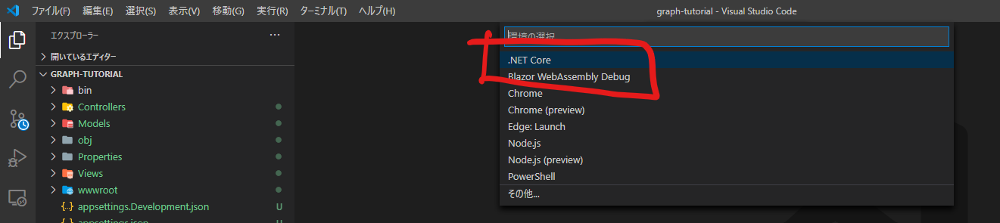
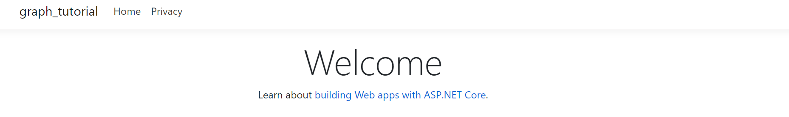

[←環境構築](./0-preparation.md)

# プロジェクトの作成

`dotnet new mvc -o GraphTutorial`

# アプリの実行

`ctrl + F5`または`dotnet run`でアプリケーションを実行します。

`.vscode`ディレクトリに`launch.json`/`tasks.json`が生成されます。

アプリケーションを実行することが確認できればOKです。

[アプリケーションの作成→](./2-practice-one.d)