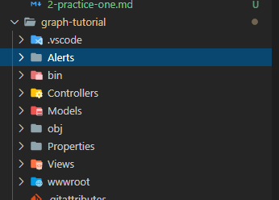
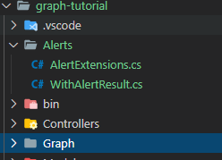

# ASP.NET MVC Web アプリを作成

## NuGetパッケージの追加

```
dotnet add package Microsoft.Identity.Web --version 1.1.0
dotnet add package Microsoft.Identity.Web.MicrosoftGraph --version 1.1.0
dotnet add package Microsoft.Identity.Web.UI --version 1.1.0
dotnet add package Microsoft.Graph --version 3.18.0
dotnet add package TimeZoneConverter
```

## Alertsディレクトリとクラスの作成



## Alerts.csの作成

``` csharp
using Microsoft.AspNetCore.Mvc;
using Microsoft.AspNetCore.Mvc.ViewFeatures;
using Microsoft.Extensions.DependencyInjection;
using System.Threading.Tasks;

namespace GraphTutorial
{
    public class WithAlertResult : IActionResult
    {
        public IActionResult Result { get; }
        public string Type { get; }
        public string Message { get; }
        public string DebugInfo { get; }

        public WithAlertResult(IActionResult result,
                                    string type,
                                    string message,
                                    string debugInfo)
        {
            Result = result;
            Type = type;
            Message = message;
            DebugInfo = debugInfo;
        }

        public async Task ExecuteResultAsync(ActionContext context)
        {
            var factory = context.HttpContext.RequestServices
            .GetService<ITempDataDictionaryFactory>();

            var tempData = factory.GetTempData(context.HttpContext);

            tempData["_alertType"] = Type;
            tempData["_alertMessage"] = Message;
            tempData["_alertDebugInfo"] = DebugInfo;

            await Result.ExecuteResultAsync(context);
        }
    }
}
```

## AlertExtensions.csの作成

``` csharp
using Microsoft.AspNetCore.Mvc;

namespace GraphTutorial
{
    public static class AlertExtensions
    {
        public static IActionResult WithError(this IActionResult result,
                                            string message,
                                            string debugInfo = null)
        {
            return Alert(result, "danger", message, debugInfo);
        }

        public static IActionResult WithSuccess(this IActionResult result,
                                            string message,
                                            string debugInfo = null)
        {
            return Alert(result, "success", message, debugInfo);
        }

        public static IActionResult WithInfo(this IActionResult result,
                                            string message,
                                            string debugInfo = null)
        {
            return Alert(result, "info", message, debugInfo);
        }

        private static IActionResult Alert(IActionResult result,
                                        string type,
                                        string message,
                                        string debugInfo)
        {
            return new WithAlertResult(result, type, message, debugInfo);
        }
    }
}
```

## Graphディレクトリの作成



## User情報拡張メソッドの実装

`Graph/GraphClaimsPrincipalExtensions.cs`を作成し下記のコードを追加する

``` csharp
using System.Security.Claims;

namespace GraphTutorial
{
    public static class GraphClaimTypes {
        public const string DisplayName ="graph_name";
        public const string Email = "graph_email";
        public const string Photo = "graph_photo";
        public const string TimeZone = "graph_timezone";
        public const string DateTimeFormat = "graph_datetimeformat";
    }

    // Helper methods to access Graph user data stored in
    // the claims principal
    public static class GraphClaimsPrincipalExtensions
    {
        public static string GetUserGraphDisplayName(this ClaimsPrincipal claimsPrincipal)
        {
            return "Adele Vance";
        }

        public static string GetUserGraphEmail(this ClaimsPrincipal claimsPrincipal)
        {
            return "adelev@contoso.com";
        }

        public static string GetUserGraphPhoto(this ClaimsPrincipal claimsPrincipal)
        {
            return "/img/no-profile-photo.png";
        }
    }
}
```

## ビューの作成

`Views/Shared`ディレクトリに`_LoginPartial.cshtml`と`_AlertPartial.cshtml`を作成する。

``` csharp
@using GraphTutorial

<ul class="nav navbar-nav">
@if (User.Identity.IsAuthenticated)
{
    <li class="nav-item dropdown">
        <a class="nav-link dropdown-toggle" data-toggle="dropdown" href="#" role="button">
            
        </a>
        <div class="dropdown-menu dropdown-menu-right">
            <h5 class="dropdown-item-text mb-0">@User.GetUserGraphDisplayName()</h5>
            <p class="dropdown-item-text text-muted mb-0">@User.GetUserGraphEmail()</p>
            <div class="dropdown-divider"></div>
            <a class="dropdown-item" asp-area="MicrosoftIdentity" asp-controller="Account" asp-action="SignOut">Sign out</a>
        </div>
    </li>
}
else
{
    <li class="nav-item">
        <a class="nav-link" asp-area="MicrosoftIdentity" asp-controller="Account" asp-action="SignIn">Sign in</a>
    </li>
}
</ul>
```

``` csharp
@{
    var type = $"{TempData["_alertType"]}";
    var message = $"{TempData["_alertMessage"]}";
    var debugInfo = $"{TempData["_alertDebugInfo"]}";
}

@if (!string.IsNullOrEmpty(type))
{
    <div class="alert alert-@type" role="alert">
        @if (string.IsNullOrEmpty(debugInfo))
        {
            <p class="mb-0">@message</p>
        }
        else
        {
            <p class="mb-3">@message</p>
            <pre class="alert-pre border bg-light p-2"><code>@debugInfo</code></pre>
        }
    </div>
}
```

`Views/Shared/_Layout.cshtml`の書き換え

``` csharp
@{
    string controller = $"{ViewContext.RouteData.Values["controller"]}";
}

<!DOCTYPE html>
<html lang="jp">
<head>
    <meta charset="utf-8" />
    <meta name="viewport" content="width=device-width, initial-scale=1.0" />
    <title>@ViewData["Title"] - GraphTutorial</title>
    <link rel="stylesheet" href="~/lib/bootstrap/dist/css/bootstrap.min.css" />
    <link rel="stylesheet" href="~/css/site.css" />
</head>
<body>
    <header>
        <nav class="navbar navbar-expand-sm navbar-toggleable-sm navbar-dark bg-dark border-bottom box-shadow mb-3">
            <div class="container">
                <a class="navbar-brand" asp-area="" asp-controller="Home" asp-action="Index">GraphTutorial</a>
                <button class="navbar-toggler" type="button" data-toggle="collapse" data-target=".navbar-collapse"
                    aria-controls="navbarSupportedContent" aria-expanded="false" aria-label="Toggle navigation">
                    <span class="navbar-toggler-icon"></span>
                </button>
                <div class="navbar-collapse collapse mr-auto">
                    <ul class="navbar-nav flex-grow-1">
                        <li class="@(controller == "Home" ? "nav-item active" : "nav-item")">
                            <a class="nav-link" asp-area="" asp-controller="Home" asp-action="Index">Home</a>
                        </li>
                        @if (User.Identity.IsAuthenticated)
                        {
                        <li class="@(controller == "Calendar" ? "nav-item active" : "nav-item")">
                            <a class="nav-link" asp-area="" asp-controller="Calendar" asp-action="Index">Calendar</a>
                        </li>
                        }
                    </ul>
                    <partial name="_LoginPartial"/>
                </div>
            </div>
        </nav>
    </header>
    <div class="container">
        <main role="main" class="pb-3">
            <partial name="_AlertPartial"/>
            @RenderBody()
        </main>
    </div>

    <footer class="border-top footer text-muted">
        <div class="container">
            © 2020 - GraphTutorial - <a asp-area="" asp-controller="Home" asp-action="Privacy">Privacy</a>
        </div>
    </footer>
    <script src="~/lib/jquery/dist/jquery.min.js"></script>
    <script src="~/lib/bootstrap/dist/js/bootstrap.bundle.min.js"></script>
    <script src="~/js/site.js" asp-append-version="true"></script>
    @RenderSection("Scripts", required: false)
</body>
</html>
```

`wwwroot/css/site.css`にCSSコードを追加

``` css
.nav-profile-photo {
  width: 32px;
}

.alert-pre {
  word-wrap: break-word;
  word-break: break-all;
  white-space: pre-wrap;
}

.calendar-view-date-cell {
  width: 150px;
}

.calendar-view-date {
  width: 40px;
  font-size: 36px;
  line-height: 36px;
  margin-right: 10px;
}

.calendar-view-month {
  font-size: 0.75em;
}

.calendar-view-timespan {
  width: 200px;
}

.calendar-view-subject {
  font-size: 1.25em;
}

.calendar-view-organizer {
  font-size: .75em;
}
```

`Views/Home/index.cshtml`を書き換え

``` csharp
@{
    ViewData["Title"] = "Home Page";
}

@using GraphTutorial

<div class="jumbotron">
    <h1>ASP.NET Core Graph Tutorial</h1>
    <p class="lead">This sample app shows how to use the Microsoft Graph API to access a user's data from ASP.NET Core</p>
    @if (User.Identity.IsAuthenticated)
    {
        <h4>Welcome @User.GetUserGraphDisplayName()!</h4>
        <p>Use the navigation bar at the top of the page to get started.</p>
    }
    else
    {
        <a class="btn btn-primary btn-large" asp-area="MicrosoftIdentity" asp-controller="Account" asp-action="SignIn">Click here to sign in</a>
    }
</div>
```

## 動作チェック

Ctrl+F5で実行してみます。

