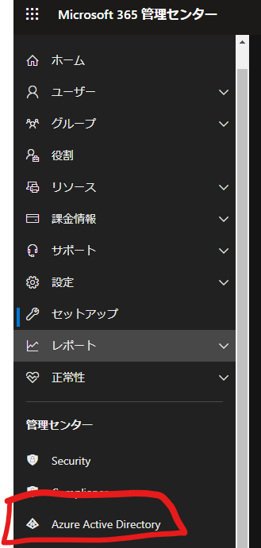
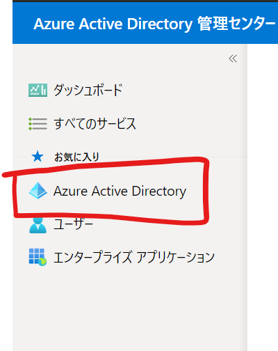
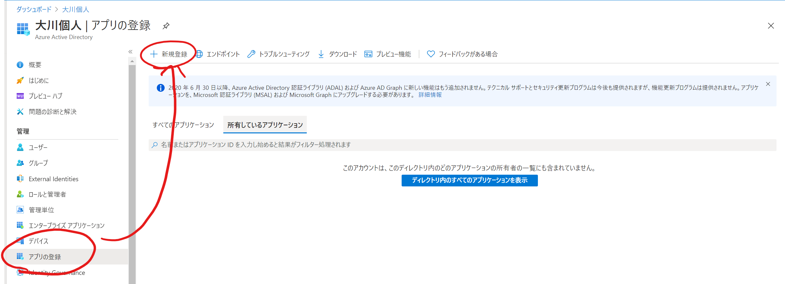
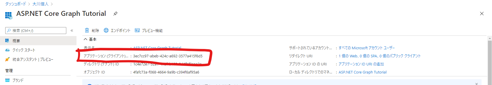
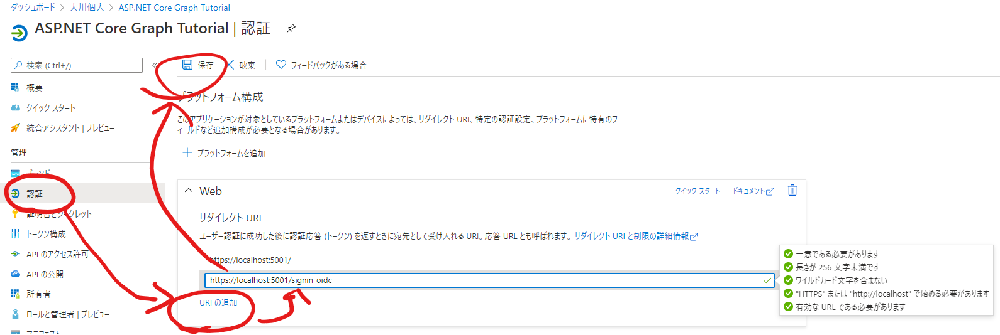
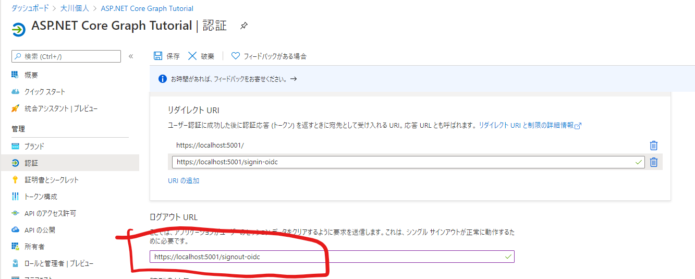
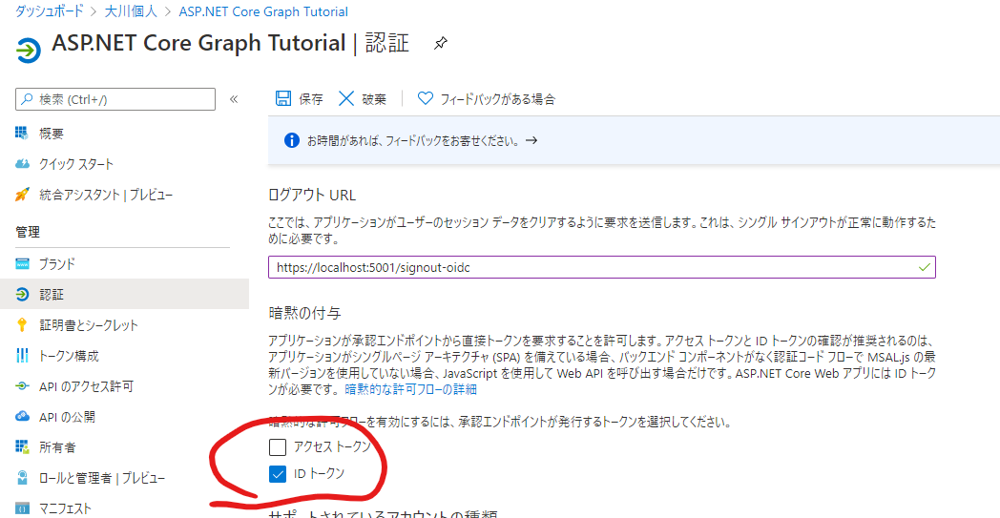
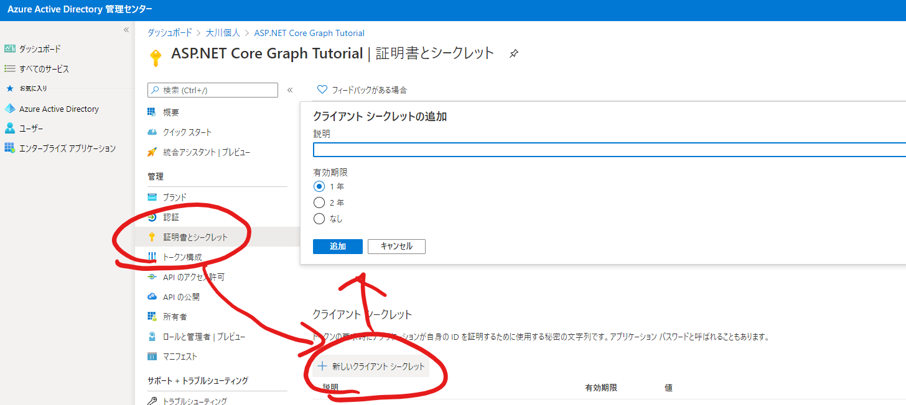

# AzureADアプリケーションの作成

Graphデータにアクセスするための認証に使用するAzureADアプリケーションを作成していきます。

## 作成するアプリケーションの情報

* 名前: ASP.NET Core Graph Tutorial
* サポートされるアカウントの種類：任意の組織ディレクトリ内のアカウント (任意の Azure AD ディレクトリ - マルチテナント) と個人の Microsoft アカウント (Skype、Xbox など)
* リダイレクトURI：https://localhost:5001
  * ASP.NETアプリケーションを実行した際のURLを指定

## 認証に必要な情報の設定と収集

### クライアントID

### リダイレクトURIの追加

「認証」タブでURLの追加を行う

URL`https://localhost:5001/signin-oidc`を追加する

(ADアプリ作成時に指定したURLに`/signin-oidc`をつけたもの)

### ログアウトURLの追加

URL`https://localhost:5001/signout-oidc`を追加する

(ADアプリ作成時に指定したURLに`/signout-oidc`をつけたもの)

### 暗黙の付与の設定

IDトークンにチェックを入れる

### シークレットの生成

認証で使用するシークレットを生成する。

下記の状態で「追加」を行う

説明：Forever

有効期限: なし

シークレットは後の工程で使用するので控えておきます。

**注意**

生成されたシークレットが参照可能なのは初回のみです。ページの更新などを行うと一部しか参照できなくなります。

ページを更新してしまった場合や、シークレットを忘れてしまった場合はもとのシークレットを削除し、再度作成し直してください。

