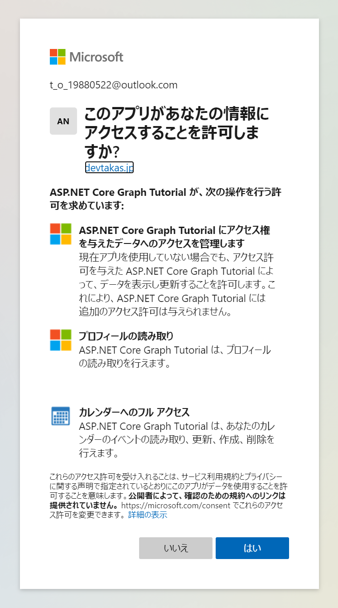
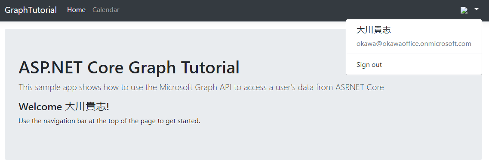

[←AzureADアプリケーションの作成](./3-gen-azure-ad-app.md)

# Azure AD 認証の追加

これは、Microsoft Graph API を呼び出すために必要なアクセストークンを取得するために必要です。この手順では、Microsoft.Identity.Webライブラリで構築します。

## `appsettings.json`の修正

``` json
{
  // 👇追加
  "AzureAd": {
    "Instance": "https://login.microsoftonline.com/",
    "TenantId": "common",
    "CallbackPath": "/signin-oidc"
  },
  // 👆追加
  "Logging": {
    "LogLevel": {
      "Default": "Information",
      "Microsoft": "Warning",
      "Microsoft.Hosting.Lifetime": "Information"
    }
  },
  "AllowedHosts": "*"
}
```

## シークレットの隠蔽

シークレットがあればユーザーのサインインフローなしにログインすることが可能となります。

つまり機密情報にあたります。みだりにGitのログなどに露出しないようシークレットを保護した状態で使用します。

下記のコマンドを実行します。

YOUR_APP_ID: 前の工程で取得したAzureADアプリのClientId

YOUR_APP_SECRET: 前の工程で取得したAzureADアプリのシークレット

```
dotnet user-secrets init
dotnet user-secrets set "AzureAd:ClientId" "YOUR_APP_ID"
dotnet user-secrets set "AzureAd:ClientSecret" "YOUR_APP_SECRET"
```

## サインインの実装

`Graph`ディレクトリに`GraphConstants.cs`を作成します。

``` csharp
namespace GraphTutorial
{
    public static class GraphConstants
    {
        // Defines the permission scopes used by the app
        public readonly static string[] Scopes =
        {
            "User.Read",
            "MailboxSettings.Read",
            "Calendars.ReadWrite"
        };
    }
}
```

`Startup.cs`に次のusing句を追加します。

``` csharp
using Microsoft.AspNetCore.Authentication.OpenIdConnect;
using Microsoft.AspNetCore.Authorization;
using Microsoft.AspNetCore.Mvc.Authorization;
using Microsoft.Identity.Web;
using Microsoft.Identity.Web.UI;
using Microsoft.IdentityModel.Protocols.OpenIdConnect;
using Microsoft.Graph;
using System.Net;
using System.Net.Http.Headers;
```

`Startup.cs`のConfiguraServiceの中身を下記で置き換えます。

``` csharp
public void ConfigureServices(IServiceCollection services)
{
    services
        // Use OpenId authentication
        .AddAuthentication(OpenIdConnectDefaults.AuthenticationScheme)
        // Specify this is a web app and needs auth code flow
        .AddMicrosoftIdentityWebApp(Configuration)
        // Add ability to call web API (Graph)
        // and get access tokens
        .EnableTokenAcquisitionToCallDownstreamApi(options => {
            Configuration.Bind("AzureAd", options);
        }, GraphConstants.Scopes)
        // Use in-memory token cache
        // See https://github.com/AzureAD/microsoft-identity-web/wiki/token-cache-serialization
        .AddInMemoryTokenCaches();

    // Require authentication
    services.AddControllersWithViews(options =>
    {
        var policy = new AuthorizationPolicyBuilder()
            .RequireAuthenticatedUser()
            .Build();
        options.Filters.Add(new AuthorizeFilter(policy));
    })
    // Add the Microsoft Identity UI pages for signin/out
    .AddMicrosoftIdentityUI();
}
```

`Startup.cs`の`Configure`に下記の処理を追加します。

``` csharp
public void Configure(IApplicationBuilder app, IWebHostEnvironment env)
{
    if (env.IsDevelopment())
    {
        app.UseDeveloperExceptionPage();
    }
    else
    {
        app.UseExceptionHandler("/Home/Error");
        // The default HSTS value is 30 days. You may want to change this for production scenarios, see https://aka.ms/aspnetcore-hsts.
        app.UseHsts();
    }
    app.UseHttpsRedirection();
    app.UseStaticFiles();

    app.UseRouting();

    app.UseAuthentication(); // 追加

    app.UseAuthorization();

    app.UseEndpoints(endpoints =>
    {
        endpoints.MapControllerRoute(
            name: "default",
            pattern: "{controller=Home}/{action=Index}/{id?}");
    });
}
```

## Viewファイルの変更

`Controllers/HomeController.cs`を下記の内容で書き換えます。

``` csharp
using GraphTutorial.Models;
using Microsoft.AspNetCore.Authorization;
using Microsoft.AspNetCore.Mvc;
using Microsoft.Extensions.Logging;
using Microsoft.Identity.Web;
using System.Diagnostics;
using System.Threading.Tasks;

namespace GraphTutorial.Controllers
{
    public class HomeController : Controller
    {
        ITokenAcquisition _tokenAcquisition;
        private readonly ILogger<HomeController> _logger;

        // Get the ITokenAcquisition interface via
        // dependency injection
        public HomeController(
            ITokenAcquisition tokenAcquisition,
            ILogger<HomeController> logger)
        {
            _tokenAcquisition = tokenAcquisition;
            _logger = logger;
        }

        public async Task<IActionResult> Index()
        {
            // TEMPORARY
            // Get the token and display it
            try
            {
                string token = await _tokenAcquisition
                    .GetAccessTokenForUserAsync(GraphConstants.Scopes);
                return View().WithInfo("Token acquired", token);
            }
            catch (MicrosoftIdentityWebChallengeUserException)
            {
                return Challenge();
            }
        }

        public IActionResult Privacy()
        {
            return View();
        }

        [ResponseCache(Duration = 0, Location = ResponseCacheLocation.None, NoStore = true)]
        public IActionResult Error()
        {
            return View(new ErrorViewModel { RequestId = Activity.Current?.Id ?? HttpContext.TraceIdentifier });
        }

        [ResponseCache(Duration = 0, Location = ResponseCacheLocation.None, NoStore = true)]
        [AllowAnonymous]
        public IActionResult ErrorWithMessage(string message, string debug)
        {
            return View("Index").WithError(message, debug);
        }
    }
}
```

## アプリケーションの実行

アプリケーションをCtrl+F5実行するとサインインダイアログに遷移します

通常のサインインフローの後アクセス許可の確認が行われますので「はい」を選択します。



アクセス許可されるスコープは下記のとおりです。

* アクセス権をあ立てたデータへのアクセス管理(offline_access)：更新トークンを取得するためにMSALによって使用される
* プロフィールの読み取り(User.Read)：ユーザーのプロフィールと写真の取得
* カレンダーへのフルアクセス(Calendar.ReadWrite)：カレンダー情報の読み取りとイベントの作成・編集

## ユーザーの詳細情報を取得する

ログインしたユーザーの詳細情報を取得します。

`Graph/GraphClaimsPrincipalExtensions.cs`を下記の内容で書き換えます。

``` csharp
using Microsoft.Graph;
using System;
using System.IO;
using System.Security.Claims;

namespace GraphTutorial
{
    public static class GraphClaimTypes {
        public const string DisplayName ="graph_name";
        public const string Email = "graph_email";
        public const string Photo = "graph_photo";
        public const string TimeZone = "graph_timezone";
        public const string TimeFormat = "graph_timeformat";
    }

    // Helper methods to access Graph user data stored in
    // the claims principal
    public static class GraphClaimsPrincipalExtensions
    {
        public static string GetUserGraphDisplayName(this ClaimsPrincipal claimsPrincipal)
        {
            return claimsPrincipal.FindFirstValue(GraphClaimTypes.DisplayName);
        }

        public static string GetUserGraphEmail(this ClaimsPrincipal claimsPrincipal)
        {
            return claimsPrincipal.FindFirstValue(GraphClaimTypes.Email);
        }

        public static string GetUserGraphPhoto(this ClaimsPrincipal claimsPrincipal)
        {
            return claimsPrincipal.FindFirstValue(GraphClaimTypes.Photo);
        }

        public static string GetUserGraphTimeZone(this ClaimsPrincipal claimsPrincipal)
        {
            return claimsPrincipal.FindFirstValue(GraphClaimTypes.TimeZone);
        }

        public static string GetUserGraphTimeFormat(this ClaimsPrincipal claimsPrincipal)
        {
            return claimsPrincipal.FindFirstValue(GraphClaimTypes.TimeFormat);
        }

        public static void AddUserGraphInfo(this ClaimsPrincipal claimsPrincipal, User user)
        {
            var identity = claimsPrincipal.Identity as ClaimsIdentity;

            identity.AddClaim(
                new Claim(GraphClaimTypes.DisplayName, user.DisplayName));
            identity.AddClaim(
                new Claim(GraphClaimTypes.Email,
                    user.Mail ?? user.UserPrincipalName));
            identity.AddClaim(
                new Claim(GraphClaimTypes.TimeZone,
                    user.MailboxSettings.TimeZone));
            identity.AddClaim(
                new Claim(GraphClaimTypes.TimeFormat, user.MailboxSettings.TimeFormat));
        }

        public static void AddUserGraphPhoto(this ClaimsPrincipal claimsPrincipal, Stream photoStream)
        {
            var identity = claimsPrincipal.Identity as ClaimsIdentity;

            if (photoStream == null)
            {
                // Add the default profile photo
                identity.AddClaim(
                    new Claim(GraphClaimTypes.Photo, "/img/no-profile-photo.png"));
                return;
            }

            // Copy the photo stream to a memory stream
            // to get the bytes out of it
            var memoryStream = new MemoryStream();
            photoStream.CopyTo(memoryStream);
            var photoBytes = memoryStream.ToArray();

            // Generate a date URI for the photo
            var photoUrl = $"data:image/png;base64,{Convert.ToBase64String(photoBytes)}";

            identity.AddClaim(
                new Claim(GraphClaimTypes.Photo, photoUrl));
        }
    }
}
```

`Startup.cs`の`AddMicrosoftIdentityWebApp(Configuration)`部分を下記のコードに書き換えます。

``` csharp
// .AddMicrosoftIdentityWebApp(Configuration)  を👇にまるまる置き換える
.AddMicrosoftIdentityWebApp(options => {
    Configuration.Bind("AzureAd", options);

    options.Prompt = "select_account";

    options.Events.OnTokenValidated = async context => {
        var tokenAcquisition = context.HttpContext.RequestServices
            .GetRequiredService<ITokenAcquisition>();

        var graphClient = new GraphServiceClient(
            new DelegateAuthenticationProvider(async (request) => {
                var token = await tokenAcquisition
                    .GetAccessTokenForUserAsync(GraphConstants.Scopes, user:context.Principal);
                request.Headers.Authorization =
                    new AuthenticationHeaderValue("Bearer", token);
            })
        );

        // Get user information from Graph
        var user = await graphClient.Me.Request()
            .Select(u => new {
                u.DisplayName,
                u.Mail,
                u.UserPrincipalName,
                u.MailboxSettings
            })
            .GetAsync();

        context.Principal.AddUserGraphInfo(user);

        // Get the user's photo
        // If the user doesn't have a photo, this throws
        try
        {
            var photo = await graphClient.Me
                .Photos["48x48"]
                .Content
                .Request()
                .GetAsync();

            context.Principal.AddUserGraphPhoto(photo);
        }
        catch (ServiceException ex)
        {
            if (ex.IsMatch("ErrorItemNotFound") ||
                ex.IsMatch("ConsumerPhotoIsNotSupported"))
            {
                context.Principal.AddUserGraphPhoto(null);
            }
            else
            {
                throw ex;
            }
        }
    };

    options.Events.OnAuthenticationFailed = context => {
        var error = WebUtility.UrlEncode(context.Exception.Message);
        context.Response
            .Redirect($"/Home/ErrorWithMessage?message=Authentication+error&debug={error}");
        context.HandleResponse();

        return Task.FromResult(0);
    };

    options.Events.OnRemoteFailure = context => {
        if (context.Failure is OpenIdConnectProtocolException)
        {
            var error = WebUtility.UrlEncode(context.Failure.Message);
            context.Response
                .Redirect($"/Home/ErrorWithMessage?message=Sign+in+error&debug={error}");
            context.HandleResponse();
        }

        return Task.FromResult(0);
    };
})
```

`Startup.cs`の`EnableTokenAcquisitionToCallDownstreamApi`のあと、`AddInMemoryTokenCaches`の前に下記のコードを差し込みます。

``` csharp
// Add a GraphServiceClient via dependency injection
.AddMicrosoftGraph(options => {
    options.Scopes = string.Join(' ', GraphConstants.Scopes);
})
```

トークンの確認は行えましたので、Homeに記載されているトークンは潰しておきます。

`Controllers`ディレクトリの`HomeController.cs`の`Index()`を下記のコードに変更します。

``` csharp
public IActionResult Index()
{
    return View();
}
```


## アプリケーションを実行してみる

アプリケーションを実行してみます。

下記のようにログインしたユーザーの情報が表示されていたら成功です。



[Calendar Viewを取得する→](./5-get-a-calender-view.md)