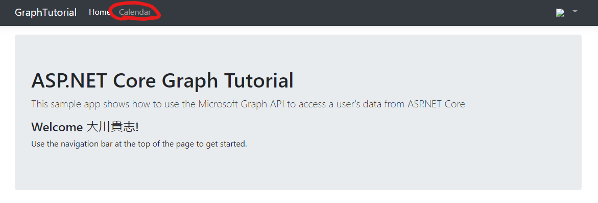
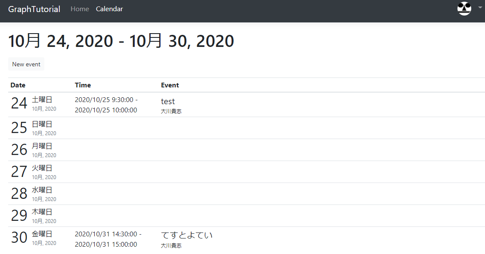

ライブラリ`Microsoft Graph Client Library for .NET`を使用してMicrosoft Graphにアクセスします。

# OutlookのCalenderイベントを取得する

`Controllers`ディレクトリに`CalendarController.cs`を作成し、下記のコードを追加します。

``` csharp
using GraphTutorial.Models;
using Microsoft.AspNetCore.Mvc;
using Microsoft.Extensions.Logging;
using Microsoft.Identity.Web;
using Microsoft.Graph;
using System;
using System.Collections.Generic;
using System.Threading.Tasks;
using TimeZoneConverter;

namespace GraphTutorial.Controllers
{
    public class CalendarController : Controller
    {
        private readonly GraphServiceClient _graphClient;
        private readonly ILogger<HomeController> _logger;

        public CalendarController(
            GraphServiceClient graphClient,
            ILogger<HomeController> logger)
        {
            _graphClient = graphClient;
            _logger = logger;
        }
    }
}
```

`CalendarController.cs`に下記のファンクションを追加します。

この一連の処理は下記のことを実装します

* ユーザーのタイム ゾーンを使用して、週の UTC の開始日と終了日/時刻の値を取得します。
* このクエリは、ユーザーの予定表ビューに対して、開始日と終了日の間にあるすべてのイベントを取得します。イベントを一覧表示する代わりに予定表ビューを使用すると、定期的なイベントが拡張され、指定したタイム ウィンドウで発生したイベントが返されます。
* `Prefer: outlook.timezone`ヘッダーを使用して、ユーザーのタイムゾーンの結果で返却します。
* `Select`はアプリで使用されるフィールドだけが戻ってくるようにフィールドを制限するために使用されます。
* `OrderBy`で結果を時系列で並べ替えます。
* `PageIterator`でイベントコレクションを通じて ページに移動します。これにより、ユーザーがカレンダー上で要求されたページ サイズよりも多くのイベントを持っている場合に処理します。

``` csharp
private async Task<IList<Event>> GetUserWeekCalendar(DateTime startOfWeek)
{
    // Configure a calendar view for the current week
    var endOfWeek = startOfWeek.AddDays(7);

    var viewOptions = new List<QueryOption>
    {
        new QueryOption("startDateTime", startOfWeek.ToString("o")),
        new QueryOption("endDateTime", endOfWeek.ToString("o"))
    };

    var events = await _graphClient.Me
        .CalendarView
        .Request(viewOptions)
        // Send user time zone in request so date/time in
        // response will be in preferred time zone
        .Header("Prefer", $"outlook.timezone=\"{User.GetUserGraphTimeZone()}\"")
        // Get max 50 per request
        .Top(50)
        // Only return fields app will use
        .Select(e => new
        {
            e.Subject,
            e.Organizer,
            e.Start,
            e.End
        })
        // Order results chronologically
        .OrderBy("start/dateTime")
        .GetAsync();

    IList<Event> allEvents;
    // Handle case where there are more than 50
    if (events.NextPageRequest != null)
    {
        allEvents = new List<Event>();
        // Create a page iterator to iterate over subsequent pages
        // of results. Build a list from the results
        var pageIterator = PageIterator<Event>.CreatePageIterator(
            _graphClient, events,
            (e) => {
                allEvents.Add(e);
                return true;
            }
        );
        await pageIterator.IterateAsync();
    }
    else
    {
        // If only one page, just use the result
        allEvents = events.CurrentPage;
    }

    return allEvents;
}

private static DateTime GetUtcStartOfWeekInTimeZone(DateTime today, TimeZoneInfo timeZone)
{
    // Assumes Sunday as first day of week
    int diff = System.DayOfWeek.Sunday - today.DayOfWeek;

    // create date as unspecified kind
    var unspecifiedStart = DateTime.SpecifyKind(today.AddDays(diff), DateTimeKind.Unspecified);

    // convert to UTC
    return TimeZoneInfo.ConvertTimeToUtc(unspecifiedStart, timeZone);
}
```

返却されたデータをViewに反映させるため、`CalendarController.cs`の`Index()`を下記の内容を追加します。

``` csharp
// Minimum permission scope needed for this view
[AuthorizeForScopes(Scopes = new[] { "Calendars.Read" })]
public async Task<IActionResult> Index()
{
    try
    {
        var userTimeZone = TZConvert.GetTimeZoneInfo(
            User.GetUserGraphTimeZone());
        var startOfWeek = CalendarController.GetUtcStartOfWeekInTimeZone(
            DateTime.Today, userTimeZone);

        var events = await GetUserWeekCalendar(startOfWeek);

        // Return a JSON dump of events
        return new ContentResult {
            Content = _graphClient.HttpProvider.Serializer.SerializeObject(events),
            ContentType = "application/json"
        };
    }
    catch (ServiceException ex)
    {
        if (ex.InnerException is MicrosoftIdentityWebChallengeUserException)
        {
            throw ex;
        }

        return new ContentResult {
            Content = $"Error getting calendar view: {ex.Message}",
            ContentType = "text/plain"
        };
    }
}
```

アプリケーションを起動し、Callenderに移動します。



JSONの文字列が表示されていたら成功です。

## ClendarViewを作成する

JSONは見づらいのでわかりやすい方法で結果を表示しましょう。

### ViewModelの作成

`Models`ディレクトリに`CalendarViewEvent.cs`を作成し、下記のコードを追加します。

``` csharp
using Microsoft.Graph;
using System;

namespace GraphTutorial.Models
{
    public class CalendarViewEvent
    {
        public string Subject { get; private set; }
        public string Organizer { get; private set; }
        public DateTime Start { get; private set; }
        public DateTime End { get; private set; }

        public CalendarViewEvent(Event graphEvent)
        {
            Subject = graphEvent.Subject;
            Organizer = graphEvent.Organizer.EmailAddress.Name;
            Start = DateTime.Parse(graphEvent.Start.DateTime);
            End = DateTime.Parse(graphEvent.End.DateTime);
        }
    }
}
```

`Models`ディレクトリに`DailyViewModel.cs`を作成し、下記のコードを追加します。

``` csharp
using System;
using System.Collections.Generic;

namespace GraphTutorial.Models
{
    public class DailyViewModel
    {
        // Day the view is for
        public DateTime Day { get; private set; }
        // Events on this day
        public IEnumerable<CalendarViewEvent> Events { get; private set; }

        public DailyViewModel(DateTime day, IEnumerable<CalendarViewEvent> events)
        {
            Day = day;
            Events = events;
        }
    }
}
```

`Models`ディレクトリに`CalendarViewModel.cs`を作成し、下記のコードを追加します。

``` csharp
using Microsoft.Graph;
using System;
using System.Collections.Generic;
using System.Linq;

namespace GraphTutorial.Models
{
    public class CalendarViewModel
    {
        private DateTime _startOfWeek;
        private List<CalendarViewEvent> _events;

        public CalendarViewModel()
        {
            _startOfWeek = DateTime.MinValue;
            _events = new List<CalendarViewEvent>();
        }

        public CalendarViewModel(DateTime startOfWeek, IEnumerable<Event> events)
        {
            _startOfWeek = startOfWeek;
            _events = new List<CalendarViewEvent>();

            if (events != null)
            {
              foreach (var item in events)
              {
                  _events.Add(new CalendarViewEvent(item));
              }
            }
        }

        // Get the start - end dates of the week
        public string TimeSpan()
        {
            return $"{_startOfWeek.ToString("MMMM d, yyyy")} - {_startOfWeek.AddDays(6).ToString("MMMM d, yyyy")}";
        }

        // Property accessors to pass to the daily view partial
        // These properties get all events on the specific day
        public DailyViewModel Sunday
        {
            get
            {
                return new DailyViewModel(
                  _startOfWeek,
                  GetEventsForDay(System.DayOfWeek.Sunday));
            }
        }

        public DailyViewModel Monday
        {
            get
            {
                return new DailyViewModel(
                  _startOfWeek.AddDays(1),
                  GetEventsForDay(System.DayOfWeek.Monday));
            }
        }

        public DailyViewModel Tuesday
        {
            get
            {
                return new DailyViewModel(
                  _startOfWeek.AddDays(2),
                  GetEventsForDay(System.DayOfWeek.Tuesday));
            }
        }

        public DailyViewModel Wednesday
        {
            get
            {
                return new DailyViewModel(
                  _startOfWeek.AddDays(3),
                  GetEventsForDay(System.DayOfWeek.Wednesday));
            }
        }

        public DailyViewModel Thursday
        {
            get
            {
                return new DailyViewModel(
                  _startOfWeek.AddDays(4),
                  GetEventsForDay(System.DayOfWeek.Thursday));
            }
        }

        public DailyViewModel Friday
        {
            get
            {
                return new DailyViewModel(
                  _startOfWeek.AddDays(5),
                  GetEventsForDay(System.DayOfWeek.Friday));
            }
        }

        public DailyViewModel Saturday
        {
            get
            {
                return new DailyViewModel(
                  _startOfWeek.AddDays(6),
                  GetEventsForDay(System.DayOfWeek.Saturday));
            }
        }

        private IEnumerable<CalendarViewEvent> GetEventsForDay(System.DayOfWeek day)
        {
            return _events.Where(e => e.Start.DayOfWeek.Equals(day));
        }
    }
}
```

### Viewの作成

`Views`ディレクトリに`Calendar`ディレクトリを作成します。

`Calendar`ディレクトリに`_DailyEventsPartial.cshtml`を作成し、下記のコードを追加します。

``` csharp
@model DailyViewModel

@{
    bool dateCellAdded = false;
    var timeFormat = User.GetUserGraphTimeFormat();
    var rowClass = Model.Day.Date.Equals(DateTime.Today.Date) ? "table-warning" : "";
}

@if (Model.Events.Count() <= 0)
{
  // Render an empty row for the day
  <tr>
    <td class="calendar-view-date-cell">
      <div class="calendar-view-date float-left text-right">@Model.Day.Day</div>
      <div class="calendar-view-day">@Model.Day.ToString("dddd")</div>
      <div class="calendar-view-month text-muted">@Model.Day.ToString("MMMM, yyyy")</div>
    </td>
    <td></td>
    <td></td>
  </tr>
}

@foreach(var item in Model.Events)
{
  <tr class="@rowClass">
    @if (!dateCellAdded)
    {
      // Only add the day cell once
      dateCellAdded = true;
      <td class="calendar-view-date-cell" rowspan="@Model.Events.Count()">
        <div class="calendar-view-date float-left text-right">@Model.Day.Day</div>
        <div class="calendar-view-day">@Model.Day.ToString("dddd")</div>
        <div class="calendar-view-month text-muted">@Model.Day.ToString("MMMM, yyyy")</div>
      </td>
    }
    <td class="calendar-view-timespan">
      <div>@item.Start.ToString(timeFormat) - @item.End.ToString(timeFormat)</div>
    </td>
    <td>
      <div class="calendar-view-subject">@item.Subject</div>
      <div class="calendar-view-organizer">@item.Organizer</div>
    </td>
  </tr>
}
```

`Calendar`ディレクトリに`Index.cshtml`を作成し、下記のコードを追加します。

``` csharp
@model CalendarViewModel

@{
    ViewData["Title"] = "Calendar";
}

<div class="mb-3">
  <h1 class="mb-3">@Model.TimeSpan()</h1>
  <a class="btn btn-light btn-sm" asp-controller="Calendar" asp-action="New">New event</a>
</div>
<div class="calendar-week">
  <div class="table-responsive">
    <table class="table table-sm">
      <thead>
        <tr>
          <th>Date</th>
          <th>Time</th>
          <th>Event</th>
        </tr>
      </thead>
      <tbody>
        <partial name="_DailyEventsPartial" for="Sunday" />
        <partial name="_DailyEventsPartial" for="Monday" />
        <partial name="_DailyEventsPartial" for="Tuesday" />
        <partial name="_DailyEventsPartial" for="Wednesday" />
        <partial name="_DailyEventsPartial" for="Thursday" />
        <partial name="_DailyEventsPartial" for="Friday" />
        <partial name="_DailyEventsPartial" for="Saturday" />
      </tbody>
    </table>
  </div>
</div>
```

### CalendarControllerの更新

`Controllers/CalendarControler`の`Index()`を下記のように変更します。

``` csharp
// Minimum permission scope needed for this view
[AuthorizeForScopes(Scopes = new[] { "Calendars.Read" })]
public async Task<IActionResult> Index()
{
    try
    {
        var userTimeZone = TZConvert.GetTimeZoneInfo(
            User.GetUserGraphTimeZone());
        var startOfWeek = CalendarController.GetUtcStartOfWeekInTimeZone(
            DateTime.Today, userTimeZone);

        var events = await GetUserWeekCalendar(startOfWeek);

        var model = new CalendarViewModel(startOfWeek, events);

        return View(model);
    }
    catch (ServiceException ex)
    {
        if (ex.InnerException is MicrosoftIdentityWebChallengeUserException)
        {
            throw ex;
        }

        return View(new CalendarViewModel())
            .WithError("Error getting calendar view", ex.Message);
    }
}
```

アプリを起動します。下図のよう予定が表示されていたら成功です。

