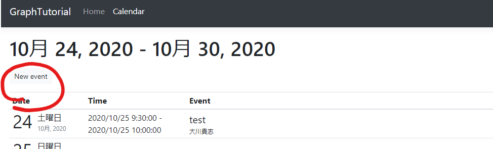
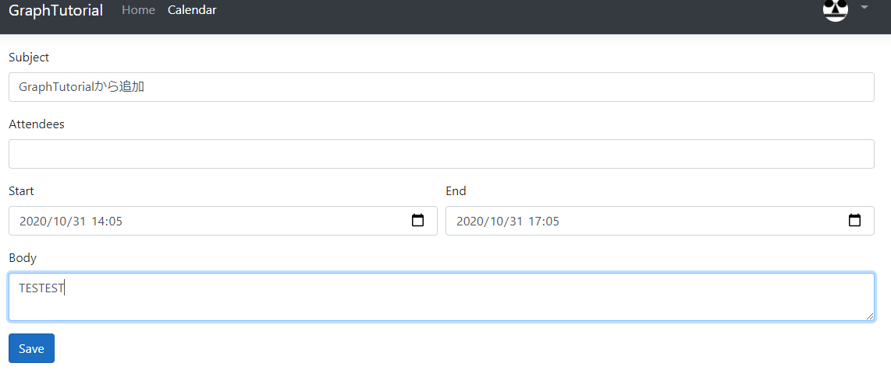
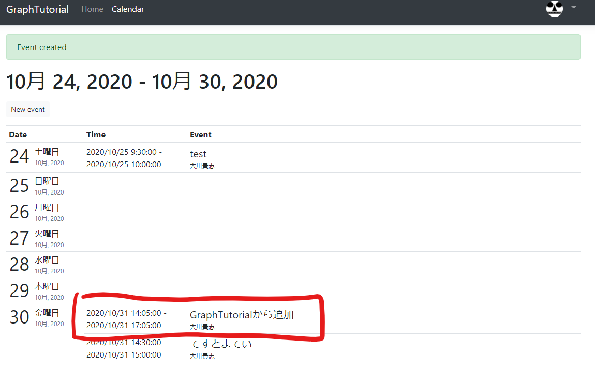

ここではユーザーの予定表に新しいイベントを作成できるように実装していきます。

## Modelの作成

`Models`ディレクトリに`NewEvent.cs`を作成し、下記のコードを追加します。

``` csharp
using System;
using System.ComponentModel.DataAnnotations;

namespace GraphTutorial.Models
{
    public class NewEvent
    {
        [Required]
        public string Subject { get; set; }
        public DateTime Start { get; set; }
        public DateTime End { get; set; }
        [DataType(DataType.MultilineText)]
        public string Body { get; set; }
        [RegularExpression(@"((\w+([-+.']\w+)*@\w+([-.]\w+)*\.\w+([-.]\w+)*)*([;])*)*",
          ErrorMessage="Please enter one or more email addresses separated by a semi-colon (;)")]
        public string Attendees { get; set; }
    }
}
```

## Viewの作成

`Views/Calendar`ディレクトリに`New.cshtml`を作成し、下記のコードを追加します。

``` csharp
@model NewEvent

@{
    ViewData["Title"] = "New event";
}

<form asp-action="New">
  <div asp-validation-summary="ModelOnly" class="text-danger"></div>
  <div class="form-group">
    <label asp-for="Subject" class="control-label"></label>
    <input asp-for="Subject" class="form-control" />
    <span asp-validation-for="Subject" class="text-danger"></span>
  </div>
  <div class="form-group">
    <label asp-for="Attendees" class="control-label"></label>
    <input asp-for="Attendees" class="form-control" />
    <span asp-validation-for="Attendees" class="text-danger"></span>
  </div>
  <div class="form-row">
    <div class="col">
      <div class="form-group">
        <label asp-for="Start" class="control-label"></label>
        <input asp-for="Start" class="form-control" />
        <span asp-validation-for="Start" class="text-danger"></span>
      </div>
    </div>
    <div class="col">
      <div class="form-group">
        <label asp-for="End" class="control-label"></label>
        <input asp-for="End" class="form-control" />
        <span asp-validation-for="End" class="text-danger"></span>
      </div>
    </div>
  </div>
  <div class="form-group">
    <label asp-for="Body" class="control-label"></label>
    <textarea asp-for="Body" class="form-control"></textarea>
    <span asp-validation-for="Body" class="text-danger"></span>
  </div>
  <div class="form-group">
    <input type="submit" value="Save" class="btn btn-primary" />
  </div>
</form>

@section Scripts {
    @{await Html.RenderPartialAsync("_ValidationScriptsPartial");}
}
```

## ControllerにActionを追加する

`Controllers/CalendarController.cs`に下記のコードを追加します。

``` chsarp
// Minimum permission scope needed for this view
[AuthorizeForScopes(Scopes = new[] { "Calendars.ReadWrite" })]
public IActionResult New()
{
    return View();
}
```

続いて同じく`CalendarController.cs`に下記のコードを追加します。

``` csharp
[HttpPost]
[ValidateAntiForgeryToken]
[AuthorizeForScopes(Scopes = new[] { "Calendars.ReadWrite" })]
public async Task<IActionResult> New([Bind("Subject,Attendees,Start,End,Body")] NewEvent newEvent)
{
    var timeZone = User.GetUserGraphTimeZone();

    // Create a Graph event with the required fields
    var graphEvent = new Event
    {
        Subject = newEvent.Subject,
        Start = new DateTimeTimeZone
        {
            DateTime = newEvent.Start.ToString("o"),
            // Use the user's time zone
            TimeZone = timeZone
        },
        End = new DateTimeTimeZone
        {
            DateTime = newEvent.End.ToString("o"),
            // Use the user's time zone
            TimeZone = timeZone
        }
    };

    // Add body if present
    if (!string.IsNullOrEmpty(newEvent.Body))
    {
        graphEvent.Body = new ItemBody
        {
            ContentType = BodyType.Text,
            Content = newEvent.Body
        };
    }

    // Add attendees if present
    if (!string.IsNullOrEmpty(newEvent.Attendees))
    {
        var attendees =
            newEvent.Attendees.Split(';', StringSplitOptions.RemoveEmptyEntries);

        if (attendees.Length > 0)
        {
            var attendeeList = new List<Attendee>();
            foreach (var attendee in attendees)
            {
                attendeeList.Add(new Attendee{
                    EmailAddress = new EmailAddress
                    {
                        Address = attendee
                    },
                    Type = AttendeeType.Required
                });
            }
        }
    }

    try
    {
        // Add the event
        await _graphClient.Me.Events
            .Request()
            .AddAsync(graphEvent);

        // Redirect to the calendar view with a success message
        return RedirectToAction("Index").WithSuccess("Event created");
    }
    catch (ServiceException ex)
    {
        // Redirect to the calendar view with an error message
        return RedirectToAction("Index")
            .WithError("Error creating event", ex.Error.Message);
    }
}
```

アプリを実行し予定を追加してみましょう。





下図のように予定が追加されたら成功です。

